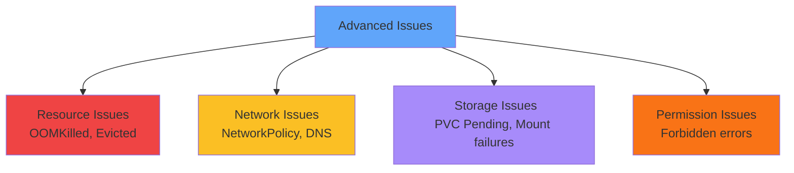

# Advanced Troubleshooting Scenarios

```mermaid
graph TB
    ADVANCED[<carbon-debug/> Advanced Issues]

    ADVANCED --> RESOURCE[<carbon-chart-area/> Resource Issues<br/>OOMKilled, Evicted]
    ADVANCED --> NETWORK[<carbon-network-3/> Network Issues<br/>NetworkPolicy, DNS]
    ADVANCED --> STORAGE[<carbon-data-volume/> Storage Issues<br/>PVC Pending, Mount failures]
    ADVANCED --> RBAC[<carbon-locked/> Permission Issues<br/>Forbidden errors]

    style ADVANCED fill:#60a5fa
    style RESOURCE fill:#ef4444
    style NETWORK fill:#fbbf24
    style STORAGE fill:#a78bfa
    style RBAC fill:#f97316
```

Complex issues require systematic approach

