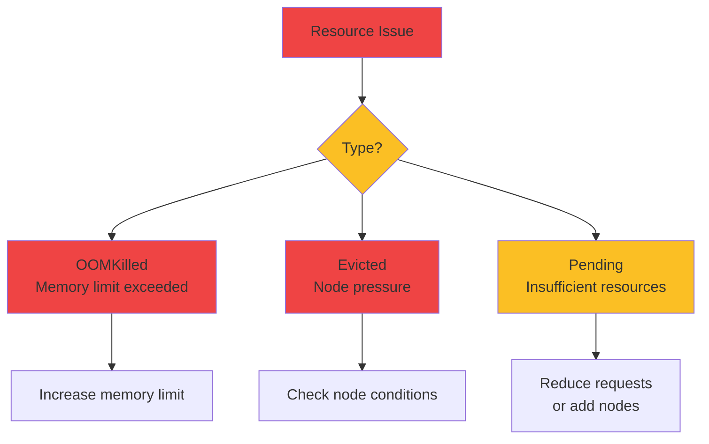

# Resource Problems

```mermaid
graph TB
    RESOURCE[<carbon-warning-alt/> Resource Issue] --> TYPE{<carbon-decision-tree/> Type?}

    TYPE --> OOM[<carbon-close-filled/> OOMKilled<br/>Memory limit exceeded]
    TYPE --> EVICTED[<carbon-logout/> Evicted<br/>Node pressure]
    TYPE --> PENDING[<carbon-time/> Pending<br/>Insufficient resources]

    OOM --> FIX1[Increase memory limit]
    EVICTED --> FIX2[Check node conditions]
    PENDING --> FIX3[Reduce requests<br/>or add nodes]

    style RESOURCE fill:#ef4444
    style TYPE fill:#fbbf24
    style OOM fill:#ef4444
    style EVICTED fill:#ef4444
    style PENDING fill:#fbbf24
```

Check describe output for resource-related events

