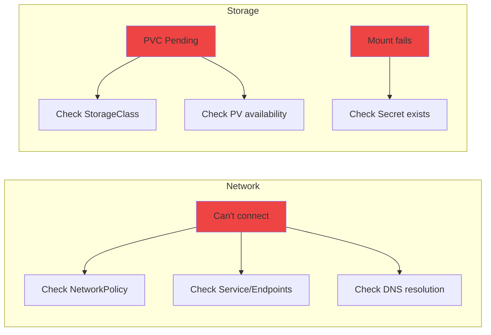

# Network & Storage Troubleshooting

```mermaid
graph LR
    subgraph Network
        NET[Can't connect] --> POLICY[Check NetworkPolicy]
        NET --> SVC[Check Service/Endpoints]
        NET --> DNS[Check DNS resolution]
    end

    subgraph Storage
        STOR[PVC Pending] --> SC[Check StorageClass]
        STOR --> PV[Check PV availability]
        MOUNT[Mount fails] --> SECRET[Check Secret exists]
    end

    style NET fill:#ef4444
    style STOR fill:#ef4444
    style MOUNT fill:#ef4444
```

Layer-by-layer diagnosis

