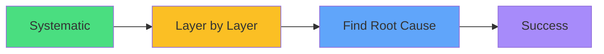

# Exam Mindset

<carbon-lightbulb class="text-yellow-400 text-4xl inline-block" />

### Complex issues need systematic breakdown
### Check each layer: Pod → Service → Network → Storage
### Use kubectl explain for field validation
### Flag and return if taking too long

