# Troubleshooting Application Modeling

<div class="abs-br m-6 flex gap-2">
  <carbon-application class="text-6xl text-blue-400" />
</div>

<div v-click class="mt-8 text-xl opacity-80">
Multi-resource dependencies and configuration
</div>

---
layout: center
---

# The Application Modeling Challenge

<div v-click="1">

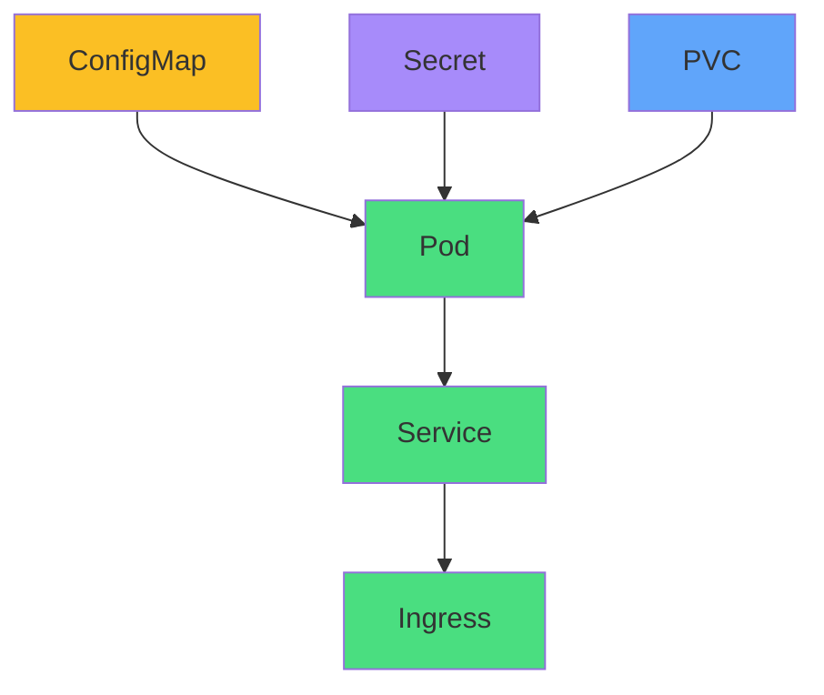

</div>

<div v-click="2" class="mt-8 text-center">
<carbon-warning class="inline-block text-3xl text-yellow-400" />
<strong class="ml-2">Any single failure breaks the chain</strong>
</div>

<div v-click="3" class="grid grid-cols-3 gap-4 mt-8 text-sm">
<div>
<carbon-settings class="inline-block text-2xl text-blue-400" /> ConfigMap
</div>
<div>
<carbon-locked class="inline-block text-2xl text-purple-400" /> Secret
</div>
<div>
<carbon-data-volume class="inline-block text-2xl text-green-400" /> PVC
</div>
</div>

<div v-click="4" class="mt-6 text-center text-sm opacity-80">
Symptoms often appear far from the root cause
</div>

---
layout: center
---

# Configuration Resources

<div v-click="1">

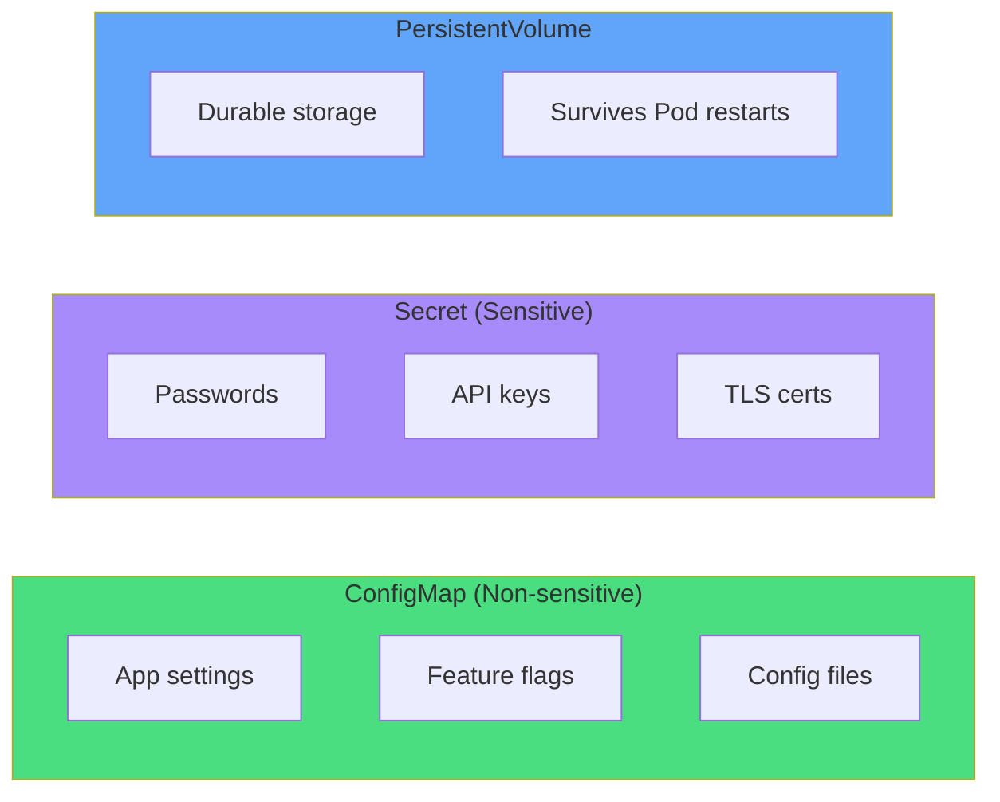

</div>

<div class="grid grid-cols-3 gap-4 mt-8 text-sm">
<div v-click="2">
<carbon-document class="text-3xl text-green-400 mb-2" />
<strong>ConfigMap</strong><br/>
Key-value pairs or files
</div>
<div v-click="3">
<carbon-security class="text-3xl text-purple-400 mb-2" />
<strong>Secret</strong><br/>
Base64 encoded data
</div>
<div v-click="4">
<carbon-data-base class="text-3xl text-blue-400 mb-2" />
<strong>PVC</strong><br/>
Storage claims
</div>
</div>

---
layout: center
---

# ConfigMap Issues

<div v-click="1">

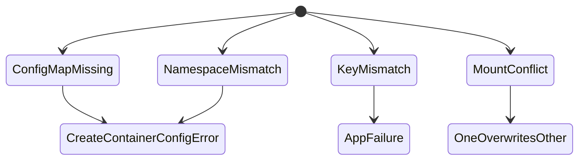

</div>

<div class="grid grid-cols-2 gap-4 mt-6 text-xs">
<div v-click="2">
<carbon-close class="inline-block text-2xl text-red-400" /> <strong>Missing ConfigMap</strong><br/>
Pod status: CreateContainerConfigError
</div>
<div v-click="3">
<carbon-tag class="inline-block text-2xl text-yellow-400" /> <strong>Key Mismatch</strong><br/>
database-url vs database_url
</div>
<div v-click="4">
<carbon-folder class="inline-block text-2xl text-blue-400" /> <strong>Wrong Namespace</strong><br/>
ConfigMap in default, Pod in app
</div>
<div v-click="5">
<carbon-warning class="inline-block text-2xl text-purple-400" /> <strong>Mount Conflicts</strong><br/>
Multiple mounts to same path
</div>
</div>

<div v-click="6" class="mt-8">

```bash
kubectl get configmap app-config
kubectl get configmap app-config -o yaml  # Check keys
```

</div>

---
layout: center
---

# ConfigMap Key Mismatch

<div v-click="1">

```yaml
# ConfigMap has
data:
  database-url: postgres://...  # hyphen

# Pod references
env:
- name: DATABASE_URL
  valueFrom:
    configMapKeyRef:
      key: database_url  # underscore!
```

</div>

<div v-click="2" class="mt-8 text-center text-red-400">
<carbon-close class="inline-block text-3xl" /> Key names must match exactly!
</div>

<div v-click="3" class="mt-6">

```bash
# Diagnose
kubectl get cm app-config -o yaml  # Check actual keys
kubectl describe pod <name>  # May show "key not found"
kubectl logs <name>  # App error about missing config
```

</div>

---
layout: center
---

# Secret Issues

<div v-click="1">

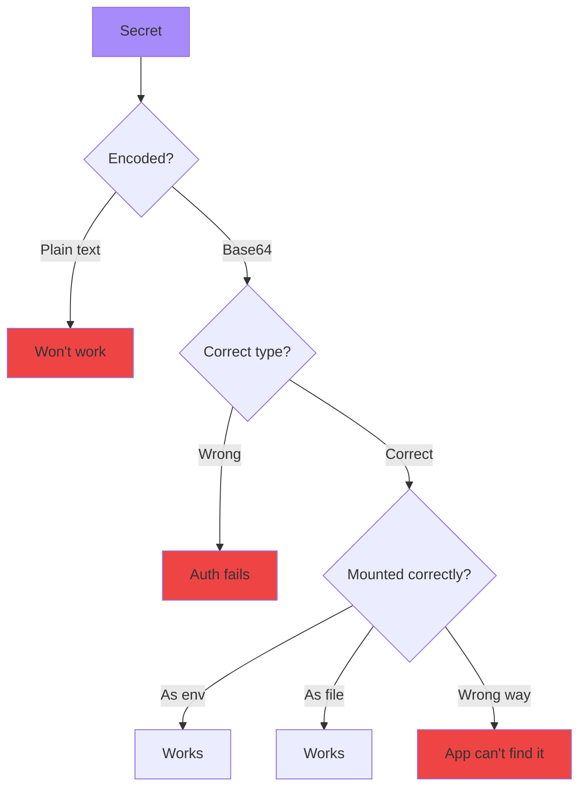

</div>

<div v-click="2" class="mt-6 text-sm">

```bash
# Create Secret properly (auto-encodes)
kubectl create secret generic db-secret \
  --from-literal=password=mypassword

# Check if mounted
kubectl exec <pod> -- env | grep SECRET
kubectl exec <pod> -- ls /path/to/secret
```

</div>

---
layout: center
---

# Secret Types

<div class="grid grid-cols-2 gap-6 mt-6 text-sm">
<div v-click="1">
<carbon-locked class="text-4xl text-gray-400 mb-2" />
<strong>Opaque</strong><br/>
Generic arbitrary data
</div>
<div v-click="2">
<carbon-container-software class="text-4xl text-blue-400 mb-2" />
<strong>dockerconfigjson</strong><br/>
Docker registry auth
</div>
<div v-click="3">
<carbon-certificate class="text-4xl text-green-400 mb-2" />
<strong>tls</strong><br/>
TLS certificates
</div>
<div v-click="4">
<carbon-user class="text-4xl text-purple-400 mb-2" />
<strong>basic-auth</strong><br/>
Basic auth credentials
</div>
</div>

<div v-click="5" class="mt-8 text-center text-yellow-400">
<carbon-warning class="inline-block text-2xl" /> Wrong type causes authentication failures
</div>

---
layout: center
---

# PersistentVolume Issues

<div v-click="1">

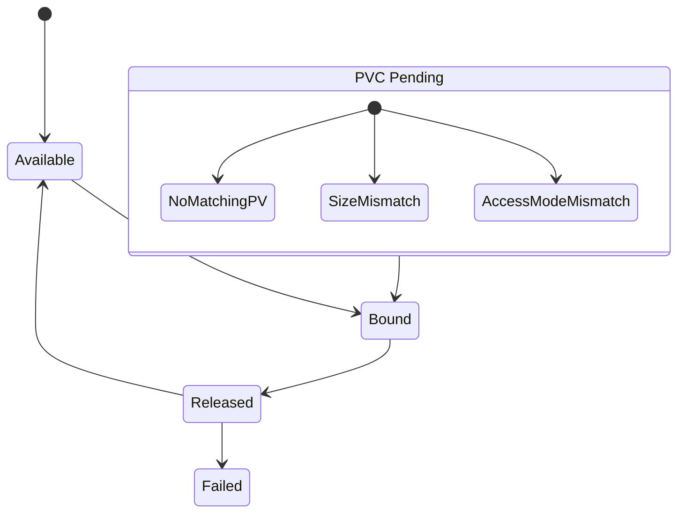

</div>

<div class="grid grid-cols-2 gap-6 mt-8 text-sm">
<div v-click="2">
<carbon-warning class="text-4xl text-yellow-400 mb-2" />
<strong>PVC Pending</strong><br/>
No matching PV available
</div>
<div v-click="3">
<carbon-pending class="text-4xl text-red-400 mb-2" />
<strong>Pod Pending</strong><br/>
Waiting for PVC to bind
</div>
</div>

<div v-click="4" class="mt-6 text-center">

```bash
kubectl get pvc  # Check STATUS
kubectl describe pvc <name>  # Check events
```

</div>

---
layout: center
---

# PVC Binding Mismatches

<div v-click="1">

```yaml
# PVC requests
spec:
  accessModes:
  - ReadWriteMany  # Needs RWX
  resources:
    requests:
      storage: 10Gi  # Needs 10Gi

# Available PV has
spec:
  accessModes:
  - ReadWriteOnce  # Only RWO!
  capacity:
    storage: 5Gi    # Only 5Gi!
```

</div>

<div v-click="2" class="mt-8 text-center text-red-400">
<carbon-close class="inline-block text-3xl" /> PVC will stay Pending!
</div>

<div v-click="3" class="mt-6 text-center text-sm">
<carbon-checkmark class="inline-block text-2xl text-green-400" /> Fix: Create PV with matching specs
</div>

---
layout: center
---

# ReadWriteOnce Conflicts

<div v-click="1">

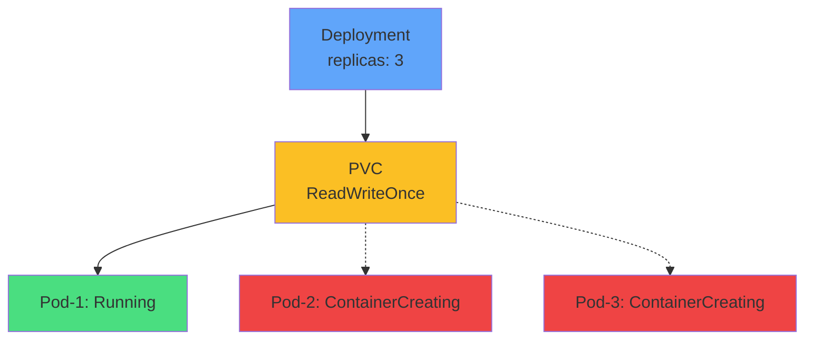

</div>

<div v-click="2" class="mt-8 text-center text-yellow-400">
<carbon-warning class="inline-block text-3xl" /> RWO = Only ONE Pod per node can use it!
</div>

<div v-click="3" class="mt-6 text-center text-sm">
<carbon-checkmark class="inline-block text-2xl text-green-400" /> Solution: Use ReadWriteMany or StatefulSet with per-Pod PVCs
</div>

---
layout: center
---

# Namespace Issues

<div v-click="1">

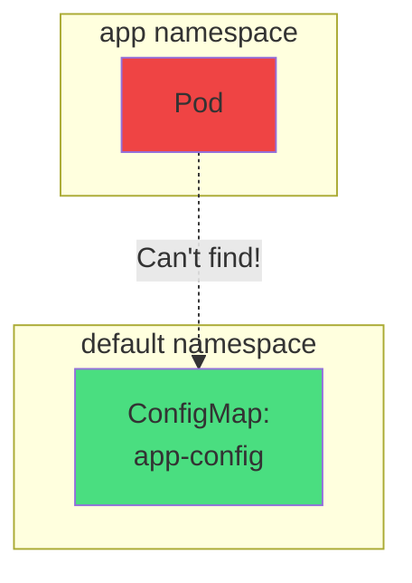

</div>

<div v-click="2" class="mt-8 text-center text-xl text-red-400">
Resources can only reference resources in same namespace!
</div>

<div v-click="3" class="mt-6 text-sm">

```bash
# Check resource namespace
kubectl get cm -A  # All namespaces
kubectl get cm -n app  # Specific namespace

# Verify pod's namespace
kubectl get pod <name> -o yaml | grep namespace
```

</div>

<div v-click="4" class="mt-6 text-center text-sm opacity-80">
Exceptions: PV, Nodes, StorageClass (cluster-wide)
</div>

---
layout: center
---

# Cross-Namespace Service DNS

<div v-click="1">

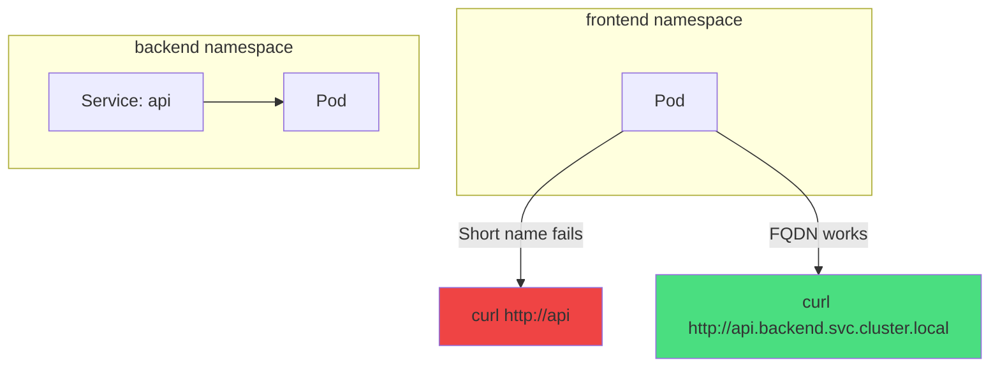

</div>

<div class="grid grid-cols-2 gap-6 mt-8 text-sm">
<div v-click="2">
<carbon-checkmark class="inline-block text-2xl text-green-400" /> <strong>Same namespace:</strong><br/>
<code>http://service</code>
</div>
<div v-click="3">
<carbon-network-3 class="inline-block text-2xl text-blue-400" /> <strong>Cross-namespace:</strong><br/>
<code>http://service.namespace</code>
</div>
</div>

---
layout: center
---

# Multi-Resource Troubleshooting

<div v-click="1">

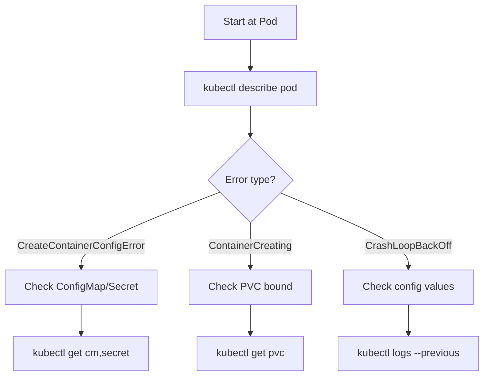

</div>

<div v-click="2" class="mt-8 text-center text-lg">
<carbon-flow class="inline-block text-2xl text-blue-400" /> Work backwards from Pod to dependencies
</div>

---
layout: center
---

# Common Error Messages

<div class="text-xs">

| Error | Root Cause | First Check |
|-------|------------|-------------|
| <span v-click="1">CreateContainerConfigError</span> | <span v-click="1">ConfigMap/Secret issue</span> | <span v-click="1">kubectl get cm,secret</span> |
| <span v-click="2">configmap "X" not found</span> | <span v-click="2">Missing ConfigMap</span> | <span v-click="2">Check namespace</span> |
| <span v-click="3">secret "X" not found</span> | <span v-click="3">Missing Secret</span> | <span v-click="3">Check namespace</span> |
| <span v-click="4">persistentvolumeclaim not bound</span> | <span v-click="4">PVC pending</span> | <span v-click="4">kubectl get pv,pvc</span> |
| <span v-click="5">key "X" not found in ConfigMap</span> | <span v-click="5">Wrong key name</span> | <span v-click="5">kubectl get cm -o yaml</span> |
| <span v-click="6">Volume already attached</span> | <span v-click="6">RWO conflict</span> | <span v-click="6">Check access mode</span> |

</div>

<div v-click="7" class="mt-8 text-center">
<carbon-idea class="inline-block text-2xl text-yellow-400" /> Error messages tell you exactly what's wrong!
</div>

---
layout: center
---

# CKAD Troubleshooting Methodology

<div v-click="1">

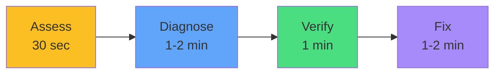

</div>

<div v-click="2" class="mt-6 text-sm">

```bash
# Phase 1: Assess (30s)
kubectl get all,cm,secret,pvc -n <namespace>
kubectl get events --sort-by='.lastTimestamp' -n <namespace>

# Phase 2: Diagnose (1-2 min)
kubectl describe pod <name>
kubectl get cm <name> -o yaml
kubectl get pvc <name>

# Phase 3: Verify (1 min)
# Check all referenced resources exist
# Check key names match
# Check namespace alignment

# Phase 4: Fix (1-2 min)
kubectl create configmap ...
kubectl edit deployment ...
kubectl delete pod ...  # Force restart
```

</div>

---
layout: center
---

# CKAD Exam Tips

<div class="grid grid-cols-2 gap-6 mt-6">
<div v-click="1">
<carbon-flash class="text-4xl text-green-400 mb-2" />
<strong>Create quickly</strong><br/>
<span class="text-sm opacity-80">kubectl create cm/secret</span>
</div>
<div v-click="2">
<carbon-folder class="text-4xl text-blue-400 mb-2" />
<strong>Check namespace</strong><br/>
<span class="text-sm opacity-80">Always verify alignment</span>
</div>
<div v-click="3">
<carbon-view class="text-4xl text-purple-400 mb-2" />
<strong>Verify keys</strong><br/>
<span class="text-sm opacity-80">-o yaml to check names</span>
</div>
<div v-click="4">
<carbon-data-volume class="text-4xl text-yellow-400 mb-2" />
<strong>PVC status</strong><br/>
<span class="text-sm opacity-80">Must be Bound</span>
</div>
</div>

<div v-click="5" class="mt-8 text-center">

```bash
# Fast ConfigMap creation
kubectl create cm app-config --from-literal=key=value

# Fast Secret creation
kubectl create secret generic db-secret --from-literal=pass=secret
```

</div>

---
layout: center
---

# Verification Checklist

<div v-click="1" class="grid grid-cols-2 gap-4 text-sm mt-6">
<div>
<carbon-checkmark class="inline-block text-2xl text-green-400" /> ConfigMaps exist in correct namespace
</div>
<div>
<carbon-checkmark class="inline-block text-2xl text-green-400" /> Secrets exist in correct namespace
</div>
<div>
<carbon-checkmark class="inline-block text-2xl text-green-400" /> All PVCs are Bound
</div>
<div>
<carbon-checkmark class="inline-block text-2xl text-green-400" /> Key names match exactly
</div>
<div>
<carbon-checkmark class="inline-block text-2xl text-green-400" /> Volume mount paths correct
</div>
<div>
<carbon-checkmark class="inline-block text-2xl text-green-400" /> Pods are Running and Ready
</div>
</div>

<div v-click="2" class="mt-8 text-center text-lg">
<carbon-idea class="inline-block text-2xl text-yellow-400" /> Check dependencies BEFORE fixing Pods!
</div>

---
layout: center
---

# Summary

<div v-click="1">

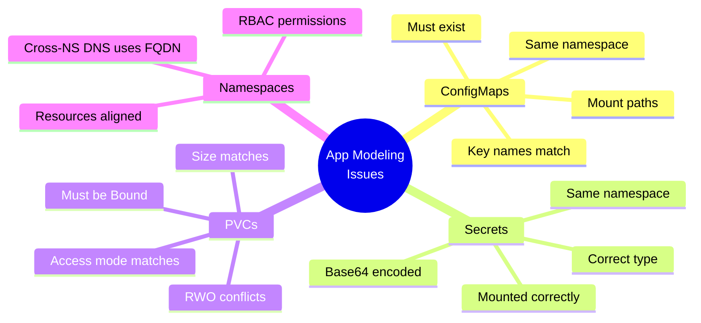

</div>

---
layout: center
---

# Key Takeaways

<div class="grid grid-cols-2 gap-6 mt-6">
<div v-click="1">
<carbon-folder class="text-4xl text-blue-400 mb-2" />
<strong>Same namespace</strong><br/>
<span class="text-sm opacity-80">ConfigMaps, Secrets, PVCs</span>
</div>
<div v-click="2">
<carbon-tag class="text-4xl text-green-400 mb-2" />
<strong>Exact key names</strong><br/>
<span class="text-sm opacity-80">Must match references</span>
</div>
<div v-click="3">
<carbon-data-volume class="text-4xl text-purple-400 mb-2" />
<strong>PVC bound</strong><br/>
<span class="text-sm opacity-80">Before Pods can use them</span>
</div>
<div v-click="4">
<carbon-search class="text-4xl text-yellow-400 mb-2" />
<strong>describe pod</strong><br/>
<span class="text-sm opacity-80">Shows dependency errors</span>
</div>
</div>

<div v-click="5" class="mt-8 text-center text-xl">
<carbon-certificate class="inline-block text-3xl text-green-400" /> Check dependencies first! <carbon-arrow-right class="inline-block text-2xl" />
</div>
