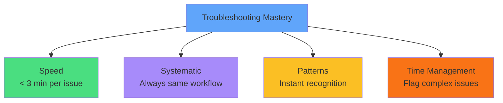

# Exam Troubleshooting Mastery

```mermaid
graph TB
    MASTER[<carbon-trophy/> Troubleshooting Mastery]

    MASTER --> SPEED[<carbon-flash/> Speed<br/>< 3 min per issue]
    MASTER --> SYSTEM[<carbon-rule/> Systematic<br/>Always same workflow]
    MASTER --> PATTERNS[<carbon-view/> Patterns<br/>Instant recognition]
    MASTER --> TIME[<carbon-time/> Time Management<br/>Flag complex issues]

    style MASTER fill:#60a5fa
    style SPEED fill:#4ade80
    style SYSTEM fill:#a78bfa
    style PATTERNS fill:#fbbf24
    style TIME fill:#f97316
```

Combine all skills for exam success

