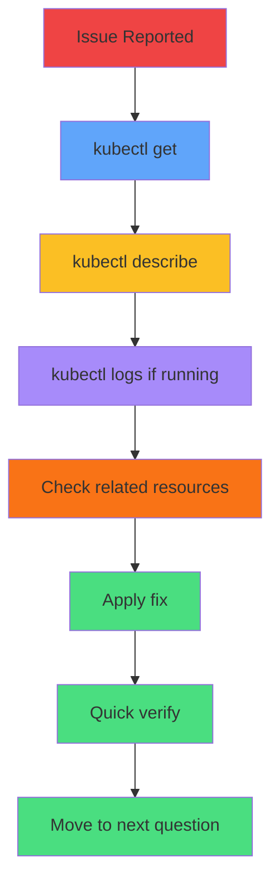

# Complete Troubleshooting Workflow

```mermaid
graph TB
    START[<carbon-warning-alt/> Issue Reported] --> GET[<carbon-terminal/> kubectl get]
    GET --> DESCRIBE[<carbon-search/> kubectl describe]
    DESCRIBE --> LOGS[<carbon-document/> kubectl logs if running]
    LOGS --> RELATED[<carbon-network-3/> Check related resources]
    RELATED --> FIX[<carbon-edit/> Apply fix]
    FIX --> VERIFY[<carbon-checkmark/> Quick verify]
    VERIFY --> DONE[<carbon-trophy/> Move to next question]

    style START fill:#ef4444
    style GET fill:#60a5fa
    style DESCRIBE fill:#fbbf24
    style LOGS fill:#a78bfa
    style RELATED fill:#f97316
    style FIX fill:#4ade80
    style VERIFY fill:#4ade80
    style DONE fill:#4ade80
```

Master this workflow for all scenarios

