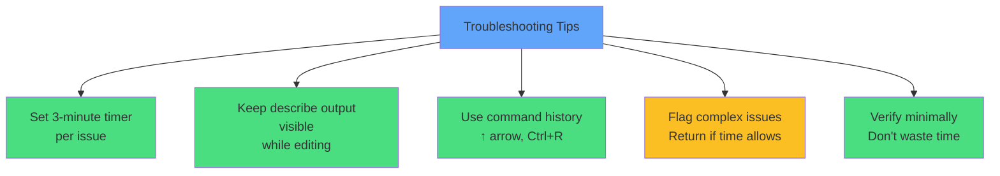

# Final Exam Tips

```mermaid
graph TB
    TIPS[<carbon-idea/> Troubleshooting Tips]

    TIPS --> T1[<carbon-time/> Set 3-minute timer<br/>per issue]
    TIPS --> T2[<carbon-document/> Keep describe output visible<br/>while editing]
    TIPS --> T3[<carbon-terminal/> Use command history<br/>↑ arrow, Ctrl+R]
    TIPS --> T4[<carbon-flag/> Flag complex issues<br/>Return if time allows]
    TIPS --> T5[<carbon-checkmark/> Verify minimally<br/>Don't waste time]

    style TIPS fill:#60a5fa
    style T1 fill:#4ade80
    style T2 fill:#4ade80
    style T3 fill:#4ade80
    style T4 fill:#fbbf24
    style T5 fill:#4ade80
```

Practical tips for exam efficiency

