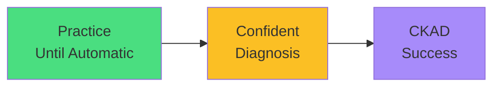

# Final Exam Mindset

<carbon-trophy class="text-yellow-400 text-6xl inline-block" />

### You've learned all CKAD topics
### Master troubleshooting through practice
### Speed comes from systematic workflows
### Patterns become instant with repetition
### You're ready for exam success!

