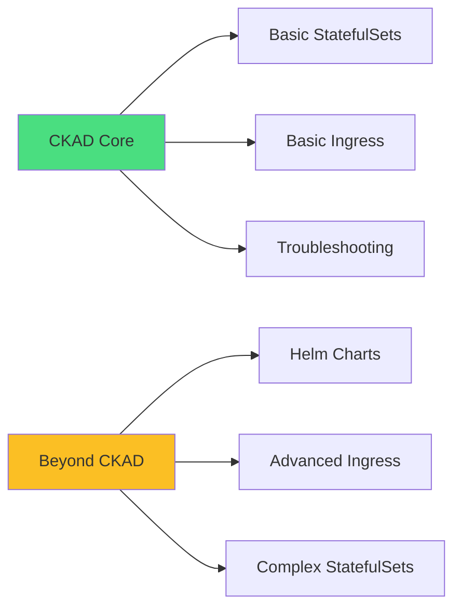
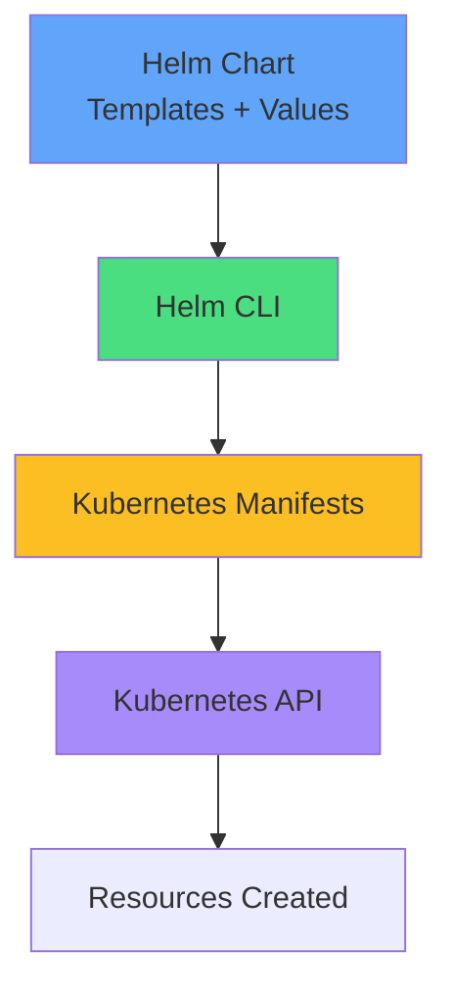
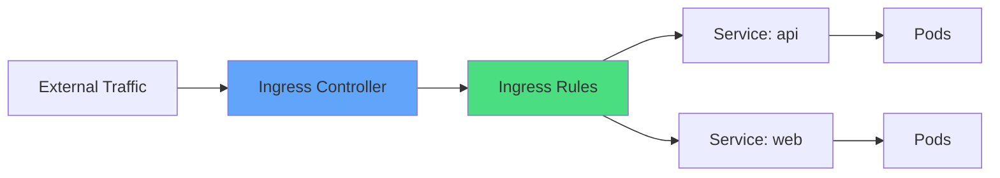
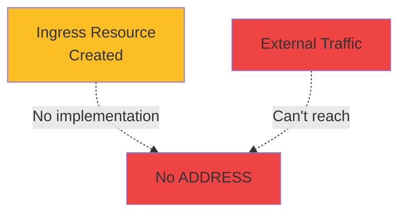
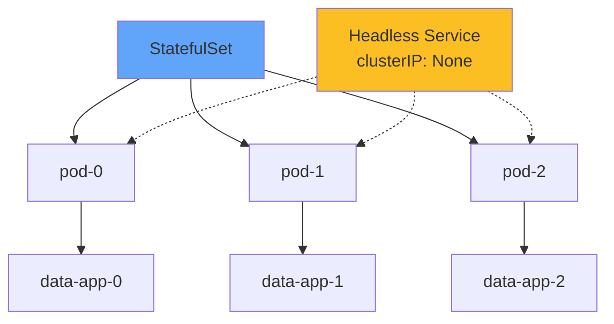
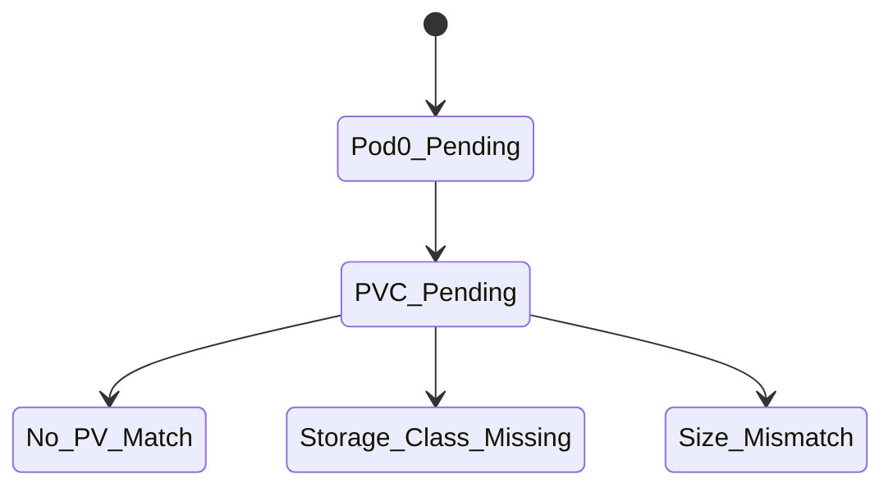
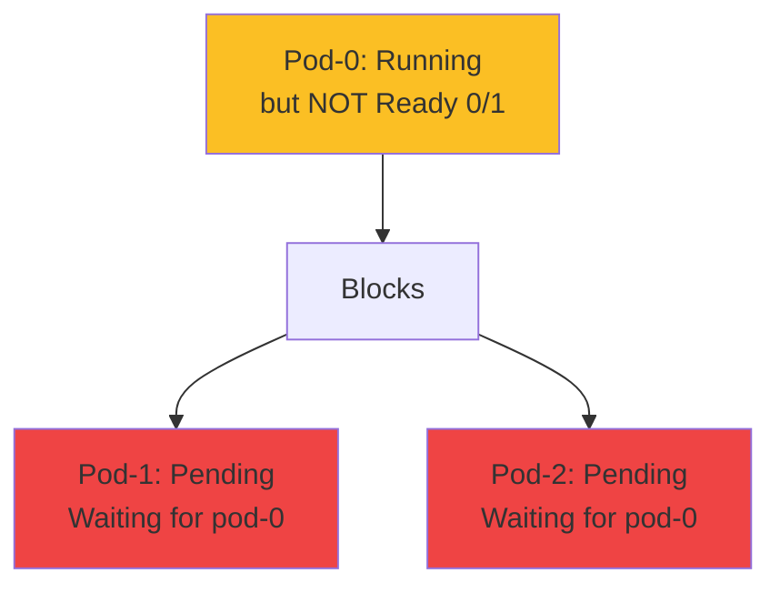
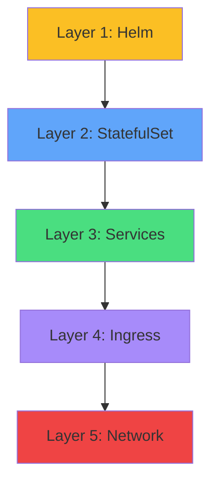
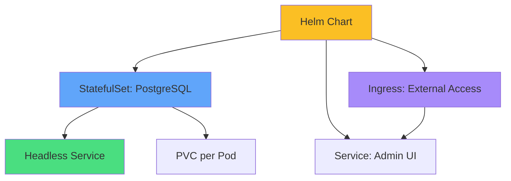
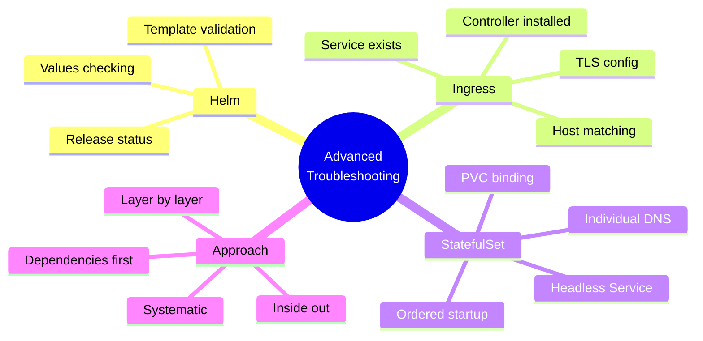

# Troubleshooting Advanced Components

<div class="abs-br m-6 flex gap-2">
  <carbon-tool-kit class="text-6xl text-blue-400" />
</div>

<div v-click class="mt-8 text-xl opacity-80">
Helm, Ingress, and StatefulSets
</div>

---
layout: center
---

# Scope and CKAD Relevance

<div v-click="1">



</div>

<div class="grid grid-cols-2 gap-6 mt-8 text-sm">
<div v-click="2">
<carbon-checkmark class="text-4xl text-green-400 mb-2" />
<strong>In CKAD Scope</strong><br/>
Basic concepts and troubleshooting
</div>
<div v-click="3">
<carbon-education class="text-4xl text-yellow-400 mb-2" />
<strong>Beyond CKAD</strong><br/>
Helm, advanced patterns
</div>
</div>

<div v-click="4" class="mt-8 text-center text-sm opacity-80">
Learn foundational skills that transfer to advanced scenarios
</div>

---
layout: center
---

# Helm Overview

<div v-click="1">



</div>

<div class="grid grid-cols-3 gap-4 mt-8 text-sm">
<div v-click="2">
<carbon-package class="text-3xl text-blue-400 mb-2" />
<strong>Chart</strong><br/>
Package of resources
</div>
<div v-click="3">
<carbon-deployment-pattern class="text-3xl text-green-400 mb-2" />
<strong>Release</strong><br/>
Installed instance
</div>
<div v-click="4">
<carbon-settings class="text-3xl text-purple-400 mb-2" />
<strong>Values</strong><br/>
Configuration parameters
</div>
</div>

<div v-click="5" class="mt-6 text-center text-lg">
<carbon-idea class="inline-block text-2xl text-yellow-400" /> Think "apt" or "yum" for Kubernetes
</div>

---
layout: center
---

# Helm Issues: Template Rendering

<div v-click="1">

```yaml
# Wrong - unclosed template
replicas: {{ .Values.replicaCount

# Right - properly closed
replicas: {{ .Values.replicaCount }}
```

</div>

<div v-click="2" class="mt-8">

```bash
# Error message
Error: parse error at (deployment.yaml:10): unclosed action
```

</div>

<div v-click="3" class="mt-8">

```bash
# Diagnose with dry-run
helm install myapp ./chart --dry-run --debug

# Check rendered output
helm template myapp ./chart
```

</div>

<div v-click="4" class="mt-6 text-center text-green-400">
<carbon-checkmark class="inline-block text-2xl" /> Always test templates before installing
</div>

---
layout: center
---

# Helm Issues: Missing Values

<div v-click="1">

```yaml
# values.yaml missing tag
image:
  repository: myapp
  # tag is missing!

# Template uses
image: {{ .Values.image.repository }}:{{ .Values.image.tag }}
# Results in: myapp:<no value>
```

</div>

<div v-click="2" class="mt-8 text-center text-red-400">
<carbon-close class="inline-block text-3xl" /> Results in ImagePullBackOff!
</div>

<div v-click="3" class="mt-6">

```bash
# Check what values were used
helm get values <release-name>

# Check full manifest
helm get manifest <release-name>
```

</div>

---
layout: center
---

# Helm Troubleshooting Commands

<div v-click="1" class="text-sm">

```bash
# List releases
helm list --all-namespaces

# Show release status
helm status <release-name>

# Show values used
helm get values <release-name>

# Show deployed manifests
helm get manifest <release-name>

# Show release history
helm history <release-name>

# Uninstall stuck release
helm uninstall <release-name>
```

</div>

<div v-click="2" class="mt-8 text-center">
<carbon-idea class="inline-block text-2xl text-yellow-400" /> Start with "helm status" for quick overview
</div>

---
layout: center
---

# Ingress Controller Overview

<div v-click="1">



</div>

<div class="grid grid-cols-2 gap-6 mt-8 text-sm">
<div v-click="2">
<carbon-network-3 class="text-4xl text-blue-400 mb-2" />
<strong>Ingress Resource</strong><br/>
Rules for routing
</div>
<div v-click="3">
<carbon-server class="text-4xl text-green-400 mb-2" />
<strong>Ingress Controller</strong><br/>
Implements rules (nginx, traefik)
</div>
</div>

<div v-click="4" class="mt-6 text-center text-lg">
Layer 7 (HTTP/HTTPS) routing through single IP
</div>

---
layout: center
---

# Ingress Issues: No Controller

<div v-click="1">



</div>

<div v-click="2" class="mt-8 text-center text-red-400 text-xl">
<carbon-warning class="inline-block text-3xl" /> Ingress without controller does nothing!
</div>

<div v-click="3" class="mt-6">

```bash
# Check if controller installed
kubectl get pods -n ingress-nginx
kubectl get pods -A | grep ingress

# Ingress shows no ADDRESS if no controller
kubectl get ingress
```

</div>

---
layout: center
---

# Ingress Issues: Service Not Found

<div v-click="1">

```yaml
apiVersion: networking.k8s.io/v1
kind: Ingress
spec:
  rules:
  - host: app.local
    http:
      paths:
      - path: /
        backend:
          service:
            name: webapp  # Must exist!
            port:
              number: 80
```

</div>

<div v-click="2" class="mt-8">

```bash
kubectl get svc webapp  # Does it exist?
kubectl describe ingress myapp  # Check backend status
```

</div>

<div v-click="3" class="mt-6 text-center text-yellow-400">
<carbon-warning class="inline-block text-2xl" /> Service must exist in same namespace!
</div>

---
layout: center
---

# Ingress Issues: Host/Path Matching

<div v-click="1">

```yaml
# Ingress expects
host: whoami.local
path: /

# Request without host header
curl http://localhost:8000  # Doesn't match!
```

</div>

<div v-click="2" class="mt-8">

```bash
# Fix: Include host header
curl -H "Host: whoami.local" http://localhost:8000

# Or add to /etc/hosts
echo "127.0.0.1 whoami.local" >> /etc/hosts
curl http://whoami.local:8000
```

</div>

<div v-click="3" class="mt-6 text-center text-green-400">
<carbon-checkmark class="inline-block text-2xl" /> Host header must match Ingress rule
</div>

---
layout: center
---

# StatefulSet Recap

<div v-click="1">



</div>

<div class="grid grid-cols-3 gap-4 mt-8 text-sm text-center">
<div v-click="2">
<carbon-order-details class="text-3xl text-blue-400 mb-2" />
<strong>Ordered</strong><br/>
Sequential startup
</div>
<div v-click="3">
<carbon-dns-services class="text-3xl text-green-400 mb-2" />
<strong>Stable DNS</strong><br/>
pod-0.service
</div>
<div v-click="4">
<carbon-data-volume class="text-3xl text-purple-400 mb-2" />
<strong>Per-Pod PVC</strong><br/>
Dedicated storage
</div>
</div>

---
layout: center
---

# StatefulSet Issues: PVC Not Binding

<div v-click="1">



</div>

<div v-click="2" class="mt-8">

```bash
# Check pods
kubectl get pods
# Shows: pod-0 Pending

# Check PVCs
kubectl get pvc
# Shows: data-pod-0 Pending

# Check why
kubectl describe pvc data-pod-0
```

</div>

<div v-click="3" class="mt-6 text-center text-green-400">
<carbon-checkmark class="inline-block text-2xl" /> Fix: Create matching PV or configure StorageClass
</div>

---
layout: center
---

# StatefulSet Issues: Ordered Startup Blocking

<div v-click="1">



</div>

<div v-click="2" class="mt-8 text-center text-yellow-400 text-lg">
<carbon-warning class="inline-block text-2xl" /> Pod-1 won't start until Pod-0 is Ready!
</div>

<div v-click="3" class="mt-6">

```bash
# Check why pod-0 isn't ready
kubectl describe pod pod-0
kubectl logs pod-0

# Fix pod-0 first, then others will start
```

</div>

---
layout: center
---

# StatefulSet Issues: Missing Headless Service

<div v-click="1">

```yaml
# Required: Headless service
apiVersion: v1
kind: Service
metadata:
  name: database
spec:
  clusterIP: None  # This makes it headless!
  selector:
    app: postgres
```

</div>

<div v-click="2">

```yaml
# StatefulSet references it
apiVersion: apps/v1
kind: StatefulSet
metadata:
  name: postgres
spec:
  serviceName: database  # Must match
```

</div>

<div v-click="3" class="mt-6 text-center text-red-400">
<carbon-close class="inline-block text-2xl" /> Without headless service, individual Pod DNS doesn't work!
</div>

---
layout: center
---

# Layer-by-Layer Troubleshooting

<div v-click="1">



</div>

<div v-click="2" class="mt-8 text-sm">

```bash
# Layer 1: Helm
helm list && helm status <release>

# Layer 2: StatefulSet
kubectl get statefulset && kubectl get pods

# Layer 3: Services
kubectl get svc && kubectl get endpoints

# Layer 4: Ingress
kubectl get ingress && kubectl describe ingress <name>

# Layer 5: Network
kubectl run test --image=busybox -it --rm -- wget -O- http://svc
```

</div>

---
layout: center
---

# Complex System Example

<div v-click="1">



</div>

<div v-click="2" class="mt-8 text-center">
<strong class="text-lg">Troubleshoot from inside out</strong>
</div>

<div v-click="3" class="grid grid-cols-2 gap-4 mt-6 text-xs">
<div>
1. Check Helm release status
</div>
<div>
2. Verify StatefulSet pods running
</div>
<div>
3. Check PVCs bound
</div>
<div>
4. Verify services have endpoints
</div>
<div>
5. Test Ingress routing
</div>
<div>
6. Check network connectivity
</div>
</div>

---
layout: center
---

# CKAD Candidates: Focus Areas

<div class="grid grid-cols-2 gap-6 mt-6">
<div v-click="1">
<carbon-checkmark class="text-4xl text-green-400 mb-2" />
<strong>Priority: Core CKAD</strong><br/>
<span class="text-sm opacity-80">Deployments, Services, basic Ingress</span>
</div>
<div v-click="2">
<carbon-education class="text-4xl text-blue-400 mb-2" />
<strong>Later: Advanced</strong><br/>
<span class="text-sm opacity-80">Helm, complex StatefulSets</span>
</div>
<div v-click="3">
<carbon-flow class="text-4xl text-purple-400 mb-2" />
<strong>Transferable: Approach</strong><br/>
<span class="text-sm opacity-80">Systematic debugging works everywhere</span>
</div>
<div v-click="4">
<carbon-tools class="text-4xl text-yellow-400 mb-2" />
<strong>Universal: kubectl</strong><br/>
<span class="text-sm opacity-80">Same commands for all resources</span>
</div>
</div>

<div v-click="5" class="mt-8 text-center text-sm opacity-80">
Master fundamentals first, then explore advanced topics
</div>

---
layout: center
---

# Key Troubleshooting Commands

<div v-click="1" class="text-sm">

```bash
# Helm
helm list
helm status <release>
helm get values <release>
helm get manifest <release>

# StatefulSet
kubectl get statefulset
kubectl describe statefulset <name>
kubectl get pvc  # Check volumes

# Ingress
kubectl get ingress
kubectl describe ingress <name>
kubectl get pods -n ingress-nginx  # Check controller

# Network Testing
kubectl run debug --image=busybox -it --rm -- wget -O- http://svc
```

</div>

---
layout: center
---

# Common Pitfalls

<div class="grid grid-cols-2 gap-4 text-sm">
<div v-click="1">
<carbon-close class="inline-block text-2xl text-red-400" /> Ingress without controller
</div>
<div v-click="2">
<carbon-close class="inline-block text-2xl text-red-400" /> StatefulSet without headless Service
</div>
<div v-click="3">
<carbon-close class="inline-block text-2xl text-red-400" /> Helm values not propagating
</div>
<div v-click="4">
<carbon-close class="inline-block text-2xl text-red-400" /> PVC not binding for StatefulSet
</div>
<div v-click="5">
<carbon-close class="inline-block text-2xl text-red-400" /> Ingress host header mismatch
</div>
<div v-click="6">
<carbon-close class="inline-block text-2xl text-red-400" /> Service in wrong namespace
</div>
<div v-click="7">
<carbon-close class="inline-block text-2xl text-red-400" /> Port configuration errors
</div>
<div v-click="8">
<carbon-close class="inline-block text-2xl text-red-400" /> Pod-0 blocking StatefulSet startup
</div>
</div>

<div v-click="9" class="mt-8 text-center">
<carbon-idea class="inline-block text-2xl text-yellow-400" /> Check dependencies before assuming resource issues
</div>

---
layout: center
---

# Summary

<div v-click="1">



</div>

---
layout: center
---

# Key Takeaways

<div class="grid grid-cols-2 gap-6 mt-6">
<div v-click="1">
<antml-package class="text-4xl text-blue-400 mb-2" />
<strong>Helm troubleshooting</strong><br/>
<span class="text-sm opacity-80">Start with template validation</span>
</div>
<div v-click="2">
<carbon-network-3 class="text-4xl text-green-400 mb-2" />
<strong>Ingress requires controller</strong><br/>
<span class="text-sm opacity-80">Check installation first</span>
</div>
<div v-click="3">
<carbon-order-details class="text-4xl text-purple-400 mb-2" />
<strong>StatefulSet ordering</strong><br/>
<span class="text-sm opacity-80">Sequential startup/shutdown</span>
</div>
<div v-click="4">
<carbon-debug class="text-4xl text-yellow-400 mb-2" />
<strong>Layer-by-layer</strong><br/>
<span class="text-sm opacity-80">Systematic debugging</span>
</div>
</div>

<div v-click="5" class="mt-8 text-center text-lg">
<carbon-certificate class="inline-block text-3xl text-green-400" /> Master fundamentals, then explore advanced! <carbon-arrow-right class="inline-block text-2xl" />
</div>
