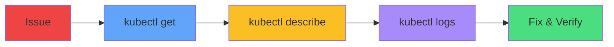

# Systematic Workflow

### Always follow the same workflow
1. Check status
2. Describe to see events
3. Check logs if running
4. Fix issue
5. Verify resolution

Systematic approach prevents wasted time

