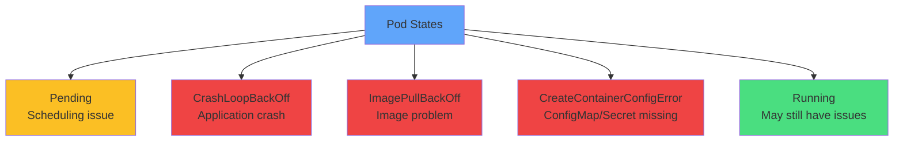

# Common Pod States

```mermaid
graph TB
    STATES[<carbon-status/> Pod States]

    STATES --> PENDING[<carbon-time/> Pending<br/>Scheduling issue]
    STATES --> CRASH[<carbon-renew/> CrashLoopBackOff<br/>Application crash]
    STATES --> IMAGE[<carbon-warning-alt/> ImagePullBackOff<br/>Image problem]
    STATES --> CONFIG[<carbon-settings/> CreateContainerConfigError<br/>ConfigMap/Secret missing]
    STATES --> RUNNING[<carbon-checkmark-filled/> Running<br/>May still have issues]

    style STATES fill:#60a5fa
    style PENDING fill:#fbbf24
    style CRASH fill:#ef4444
    style IMAGE fill:#ef4444
    style CONFIG fill:#ef4444
    style RUNNING fill:#4ade80
```

State indicates problem type

