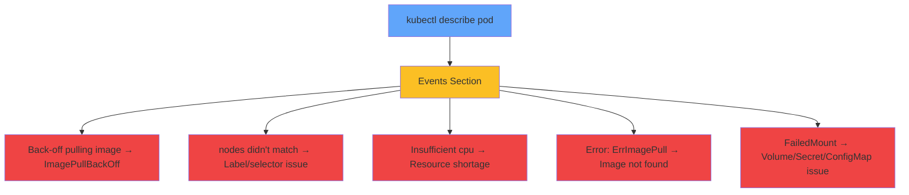

# Reading describe Events

```mermaid
graph TB
    DESC[<carbon-search/> kubectl describe pod] --> EVENTS[<carbon-document/> Events Section]

    EVENTS --> E1["Back-off pulling image" → ImagePullBackOff]
    EVENTS --> E2["nodes didn't match" → Label/selector issue]
    EVENTS --> E3["Insufficient cpu" → Resource shortage]
    EVENTS --> E4["Error: ErrImagePull" → Image not found]
    EVENTS --> E5["FailedMount" → Volume/Secret/ConfigMap issue]

    style DESC fill:#60a5fa
    style EVENTS fill:#fbbf24
    style E1 fill:#ef4444
    style E2 fill:#ef4444
    style E3 fill:#ef4444
    style E4 fill:#ef4444
    style E5 fill:#ef4444
```

Events contain the diagnosis

