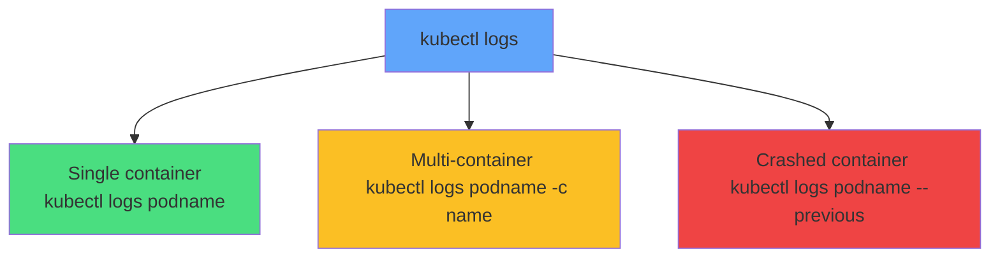

# Checking Logs

```mermaid
graph TB
    LOGS[<carbon-document/> kubectl logs]

    LOGS --> SINGLE[<carbon-terminal/> Single container<br/>kubectl logs podname]
    LOGS --> MULTI[<carbon-terminal/> Multi-container<br/>kubectl logs podname -c name]
    LOGS --> PREVIOUS[<carbon-terminal/> Crashed container<br/>kubectl logs podname --previous]

    style LOGS fill:#60a5fa
    style SINGLE fill:#4ade80
    style MULTI fill:#fbbf24
    style PREVIOUS fill:#ef4444
```

### Logs reveal application issues
- Startup errors
- Configuration problems
- Application crashes
- Missing dependencies

