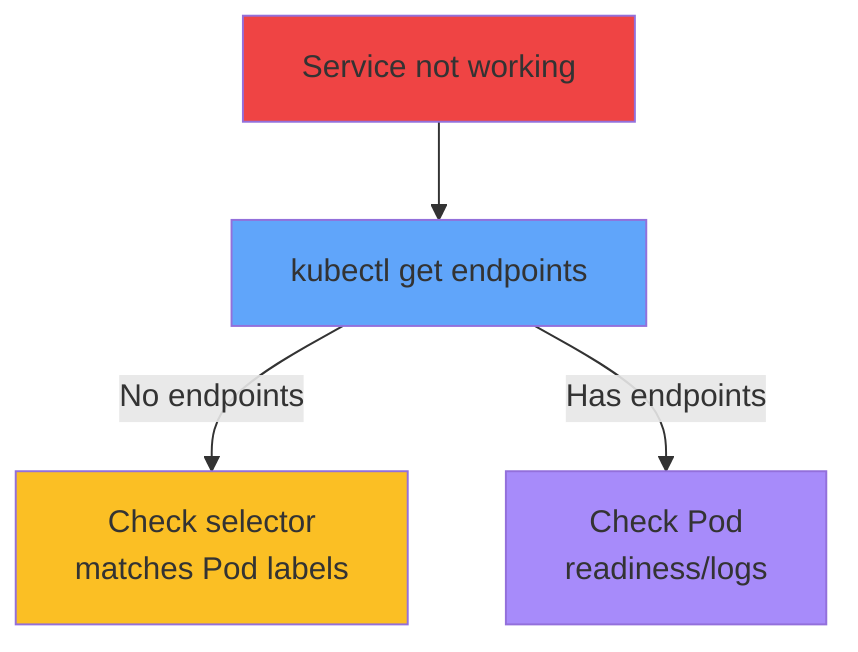

# Service Troubleshooting

```mermaid
graph TB
    SERVICE[<carbon-network-3/> Service not working] --> ENDPOINTS[<carbon-search/> kubectl get endpoints]

    ENDPOINTS -->|No endpoints| SELECTOR[<carbon-tag/> Check selector<br/>matches Pod labels]
    ENDPOINTS -->|Has endpoints| POD[<carbon-container-software/> Check Pod<br/>readiness/logs]

    style SERVICE fill:#ef4444
    style ENDPOINTS fill:#60a5fa
    style SELECTOR fill:#fbbf24
    style POD fill:#a78bfa
```

### Service → Endpoints → Pods
Check each layer systematically

No endpoints = selector mismatch or no ready Pods

