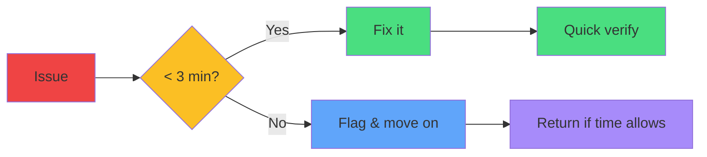

# Time Management

```mermaid
graph LR
    ISSUE[<carbon-warning-alt/> Issue] --> QUICK{<carbon-time/> < 3 min?}

    QUICK -->|Yes| FIX[<carbon-edit/> Fix it]
    QUICK -->|No| FLAG[<carbon-flag/> Flag & move on]

    FIX --> VERIFY[<carbon-checkmark/> Quick verify]
    FLAG --> RETURN[<carbon-restart/> Return if time allows]

    style ISSUE fill:#ef4444
    style QUICK fill:#fbbf24
    style FIX fill:#4ade80
    style FLAG fill:#60a5fa
    style VERIFY fill:#4ade80
    style RETURN fill:#a78bfa
```

Don't waste time on complex issues 
Finish quick wins first

