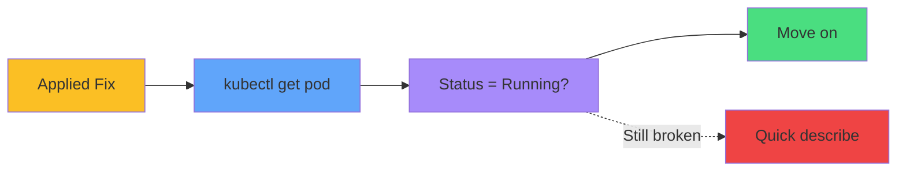

# Quick Verification

```mermaid
graph LR
    FIX[<carbon-edit/> Applied Fix] --> CHECK1[<carbon-terminal/> kubectl get pod] --> CHECK2[<carbon-view/> Status = Running?] --> DONE[<carbon-checkmark-filled/> Move on]

    CHECK2 -.->|Still broken| DESCRIBE[<carbon-search/> Quick describe]

    style FIX fill:#fbbf24
    style CHECK1 fill:#60a5fa
    style CHECK2 fill:#a78bfa
    style DONE fill:#4ade80
    style DESCRIBE fill:#ef4444
```

### Don't over-verify
Quick status check is enough

Excessive verification wastes exam time

