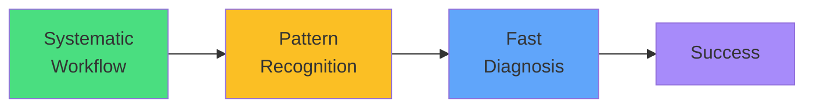

# Exam Mindset

<carbon-lightbulb class="text-yellow-400 text-4xl inline-block" />

### Follow workflow: get → describe → logs
### Events contain most diagnoses
### Fix quickly, verify briefly, move on
### Practice until automatic

