# Troubleshooting Kubernetes Apps

<div class="abs-br m-6 flex gap-2">
  <carbon-debug class="text-6xl text-blue-400" />
</div>

<div v-click class="mt-8 text-xl opacity-80">
Essential CKAD skill for diagnosing and fixing issues
</div>

---
layout: center
---

# The Troubleshooting Challenge

<div v-click="1">

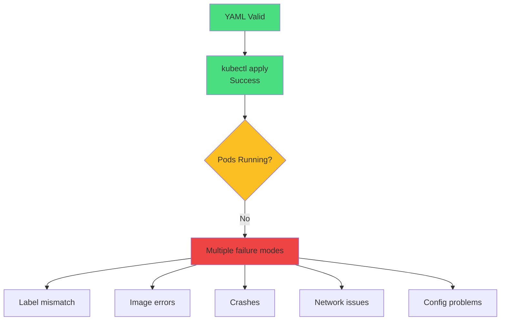

</div>

<div v-click="2" class="mt-8 text-center text-yellow-400">
<carbon-warning class="inline-block text-3xl" /> Kubernetes validates syntax, not functionality!
</div>

<div v-click="3" class="text-center text-sm opacity-80">
Objects are loosely coupled - typos break everything silently
</div>

---
layout: center
---

# Systematic Troubleshooting

<div v-click="1">

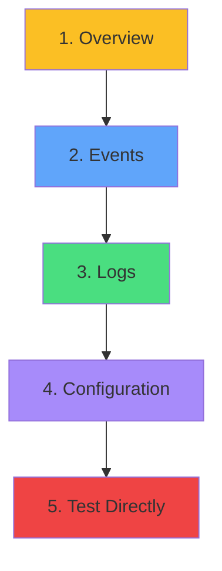

</div>

<div class="grid grid-cols-3 gap-4 mt-8 text-sm">
<div v-click="2">
<carbon-view class="text-3xl text-yellow-400 mb-2" />
<strong>Get Overview</strong><br/>
kubectl get
</div>
<div v-click="3">
<carbon-event class="text-3xl text-blue-400 mb-2" />
<strong>Check Events</strong><br/>
kubectl describe
</div>
<div v-click="4">
<carbon-document class="text-3xl text-green-400 mb-2" />
<strong>Review Logs</strong><br/>
kubectl logs
</div>
<div v-click="5">
<carbon-settings class="text-3xl text-purple-400 mb-2" />
<strong>Verify Config</strong><br/>
Check selectors
</div>
<div v-click="6">
<carbon-test-tool class="text-3xl text-red-400 mb-2" />
<strong>Test Direct</strong><br/>
port-forward, exec
</div>
</div>

<div v-click="7" class="mt-8 text-center text-lg">
<carbon-time class="inline-block text-2xl text-yellow-400" /> CKAD: Identify issues in 2-3 minutes
</div>

---
layout: center
---

# Essential Troubleshooting Commands

<div v-click="1" class="mb-4 text-sm">

```bash
# Level 1: Overview
kubectl get pods
kubectl get pods -o wide
kubectl get all
kubectl get events --sort-by='.lastTimestamp'
```

</div>

<div v-click="2" class="mb-4 text-sm">

```bash
# Level 2: Detailed Investigation
kubectl describe pod <pod-name>
kubectl logs <pod-name>
kubectl logs <pod-name> --previous  # Previous crash!
kubectl logs <pod-name> -c <container>  # Multi-container
```

</div>

<div v-click="3" class="text-sm">

```bash
# Level 3: Interactive Debugging
kubectl exec -it <pod-name> -- sh
kubectl port-forward <pod-name> 8080:80
kubectl run debug --image=busybox -it --rm -- sh
```

</div>

<div v-click="4" class="mt-6 text-center text-red-400">
<carbon-warning class="inline-block text-2xl" /> Memorize these for the exam!
</div>

---
layout: center
---

# ImagePullBackOff

<div v-click="1">

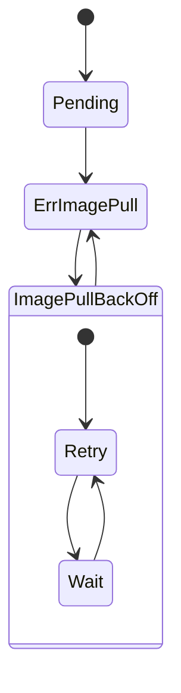

</div>

<div class="grid grid-cols-2 gap-4 mt-6 text-sm">
<div v-click="2">
<carbon-warning class="inline-block text-2xl text-yellow-400" /> <strong>Symptoms:</strong><br/>
Pod stuck in ImagePullBackOff
</div>
<div v-click="3">
<carbon-close class="inline-block text-2xl text-red-400" /> <strong>Root Causes:</strong><br/>
Image name typo, doesn't exist, auth failure
</div>
</div>

<div v-click="4" class="mt-6">

```bash
kubectl describe pod <name>
# Events: "Failed to pull image" with details
```

</div>

<div v-click="5" class="mt-4 text-center text-green-400">
<carbon-checkmark class="inline-block text-2xl" /> Fix: Correct image name or add imagePullSecret
</div>

---
layout: center
---

# CrashLoopBackOff

<div v-click="1">

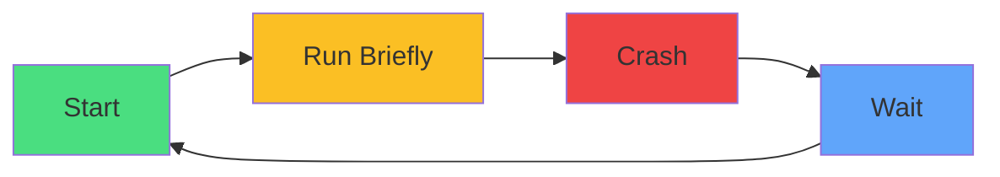

</div>

<div class="grid grid-cols-2 gap-4 mt-6 text-sm">
<div v-click="2">
<carbon-restart class="inline-block text-2xl text-yellow-400" /> <strong>Symptoms:</strong><br/>
RESTARTS count increasing
</div>
<div v-click="3">
<carbon-close class="inline-block text-2xl text-red-400" /> <strong>Root Causes:</strong><br/>
App error, missing config, failed probe, OOMKilled
</div>
</div>

<div v-click="4" class="mt-6">

```bash
kubectl logs <pod-name> --previous  # CRITICAL!
kubectl describe pod <name>
# Check: Last State: Terminated (Exit Code)
```

</div>

<div v-click="5" class="mt-4 text-center text-red-400 text-sm">
<carbon-warning class="inline-block text-2xl" /> Always check --previous logs for crashes!
</div>

---
layout: center
---

# Pending State

<div v-click="1">

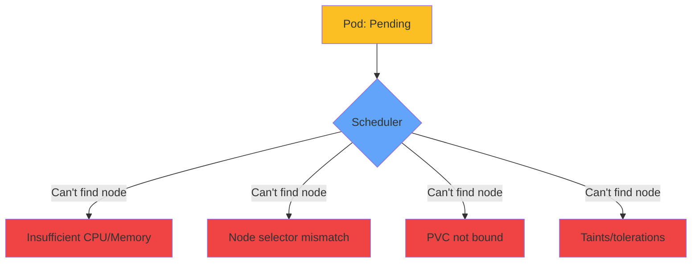

</div>

<div v-click="2" class="mt-8">

```bash
kubectl describe pod <name>
# Events show:
# - "Insufficient cpu" or "Insufficient memory"
# - "No nodes available that match selector"
# - "persistentvolumeclaim not bound"
```

</div>

<div v-click="3" class="mt-6 text-center text-green-400">
<carbon-checkmark class="inline-block text-2xl" /> Fix: Reduce requests, fix selector, create PV
</div>

---
layout: center
---

# Service Not Finding Pods

<div v-click="1">

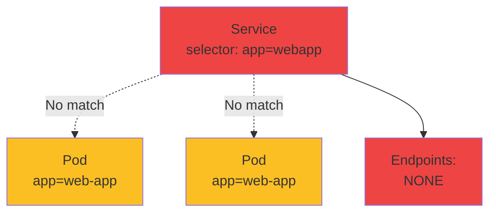

</div>

<div v-click="2" class="mt-8 text-center text-xl text-red-400">
<carbon-warning class="inline-block text-3xl" /> Most common Kubernetes problem!
</div>

<div v-click="3" class="mt-6">

```bash
kubectl get endpoints <service-name>
# Shows: <none>  ← Problem!

kubectl get pods --show-labels
# Find label mismatch
```

</div>

<div v-click="4" class="mt-4 text-center text-sm opacity-80">
Service selector must match Pod labels exactly
</div>

---
layout: center
---

# Port Mismatch

<div v-click="1">

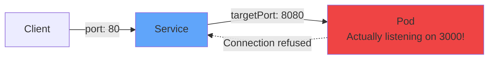

</div>

<div v-click="2" class="mt-8">

```yaml
# Service expects
targetPort: 8080

# Container actually uses
containerPort: 3000  # Mismatch!
```

</div>

<div v-click="3" class="mt-6">

```bash
# Test directly with port-forward
kubectl port-forward pod/webapp-xxxx 8080:3000
# If this works but service doesn't → port mismatch
```

</div>

<div v-click="4" class="mt-6 text-center text-green-400">
<carbon-checkmark class="inline-block text-2xl" /> Fix: Match targetPort to containerPort
</div>

---
layout: center
---

# Container Not Ready

<div v-click="1">

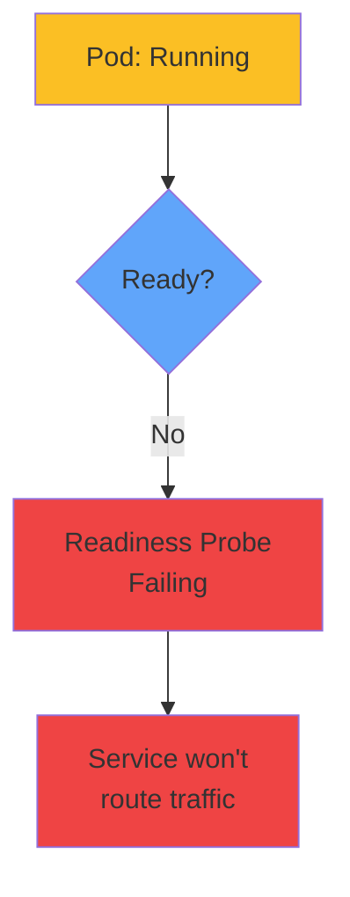

</div>

<div class="grid grid-cols-2 gap-6 mt-8 text-sm">
<div v-click="2">
<carbon-warning class="inline-block text-2xl text-yellow-400" /> <strong>Symptoms:</strong><br/>
READY shows 0/1, STATUS: Running
</div>
<div v-click="3">
<carbon-health-cross class="inline-block text-2xl text-red-400" /> <strong>Root Cause:</strong><br/>
Readiness probe failing or too aggressive
</div>
</div>

<div v-click="4" class="mt-6">

```bash
kubectl describe pod <name>
# Events: "Readiness probe failed: HTTP probe failed"
```

</div>

<div v-click="5" class="mt-4 text-center text-green-400">
<carbon-checkmark class="inline-block text-2xl" /> Fix: Increase initialDelaySeconds, fix probe path
</div>

---
layout: center
---

# Configuration Issues

<div v-click="1">

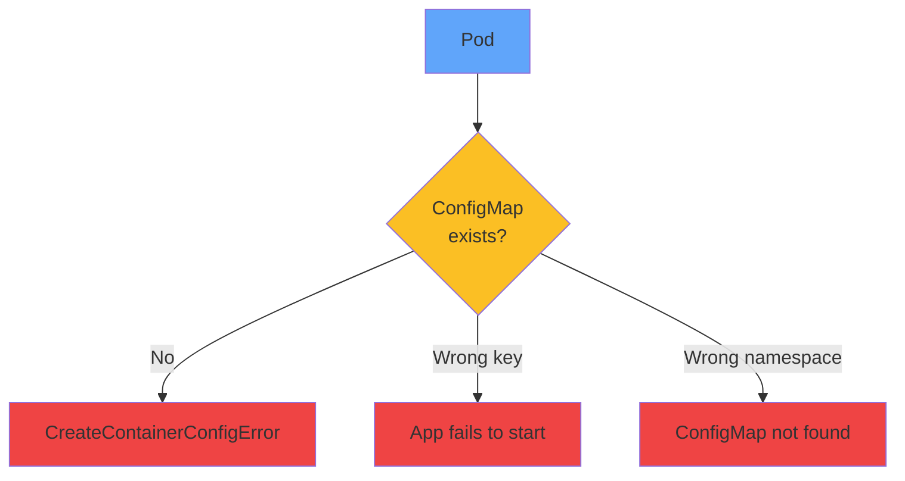

</div>

<div v-click="2" class="mt-8">

```bash
# Check ConfigMap exists
kubectl get configmap app-config
# If not found → Problem!

# Check ConfigMap keys
kubectl get configmap app-config -o yaml
```

</div>

<div v-click="3" class="mt-6 text-center text-red-400 text-sm">
<carbon-warning class="inline-block text-2xl" /> ConfigMap/Secret must exist in same namespace!
</div>

---
layout: center
---

# CKAD Troubleshooting Strategy

<div v-click="1">

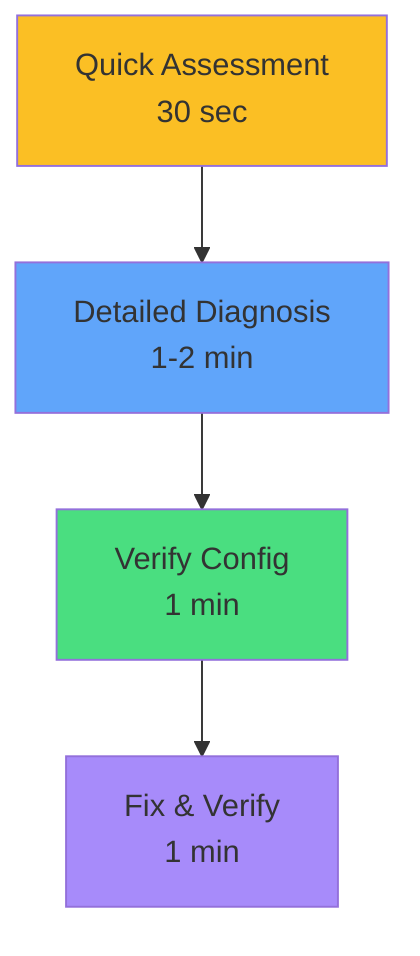

</div>

<div v-click="2" class="mt-6 text-sm">

```bash
# Phase 1: Quick Assessment
kubectl get all && kubectl get events --sort-by='.lastTimestamp' | tail

# Phase 2: Detailed Diagnosis
kubectl describe pod <failing-pod> && kubectl logs <pod>

# Phase 3: Verify Configuration
kubectl get endpoints <svc> && kubectl get pods --show-labels

# Phase 4: Fix and Verify
kubectl edit ... && kubectl get pods
```

</div>

<div v-click="3" class="mt-6 text-center text-yellow-400">
<carbon-time class="inline-block text-2xl" /> Total time budget: 4-5 minutes per question
</div>

---
layout: center
---

# Common Error Patterns

<div class="text-xs">

| Error | Root Cause | First Action |
|-------|------------|--------------|
| <span v-click="1">ImagePullBackOff</span> | <span v-click="1">Image name or auth</span> | <span v-click="1"><carbon-search class="inline-block"/> describe pod</span> |
| <span v-click="2">CrashLoopBackOff</span> | <span v-click="2">App error</span> | <span v-click="2"><carbon-document class="inline-block"/> logs --previous</span> |
| <span v-click="3">Pending</span> | <span v-click="3">Resources/scheduling</span> | <span v-click="3"><carbon-search class="inline-block"/> describe pod</span> |
| <span v-click="4">Running not Ready</span> | <span v-click="4">Readiness probe</span> | <span v-click="4"><carbon-health-cross class="inline-block"/> check probe</span> |
| <span v-click="5">Service no endpoints</span> | <span v-click="5">Label mismatch</span> | <span v-click="5"><carbon-tag class="inline-block"/> check labels</span> |
| <span v-click="6">CreateContainerConfigError</span> | <span v-click="6">ConfigMap/Secret missing</span> | <span v-click="6"><carbon-settings class="inline-block"/> get cm,secret</span> |

</div>

<div v-click="7" class="mt-8 text-center text-lg">
<carbon-idea class="inline-block text-2xl text-yellow-400" /> Learn to recognize patterns quickly!
</div>

---
layout: center
---

# Troubleshooting Decision Tree

<div v-click="1">

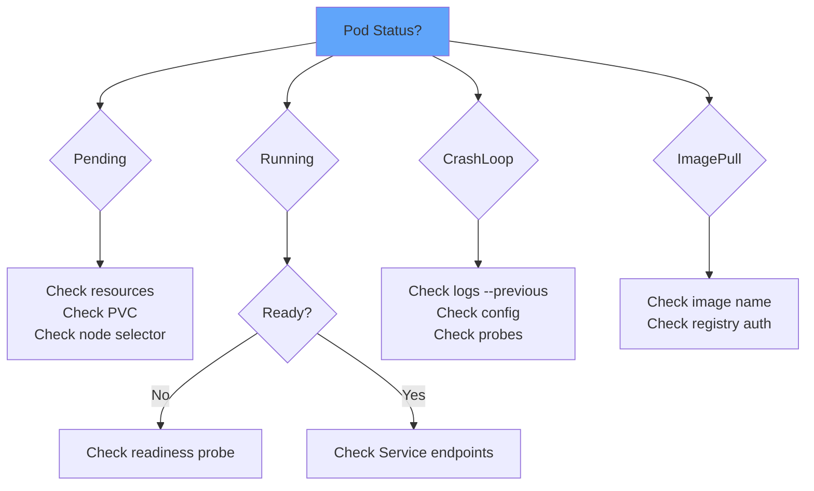

</div>

---
layout: center
---

# Summary

<div v-click="1">

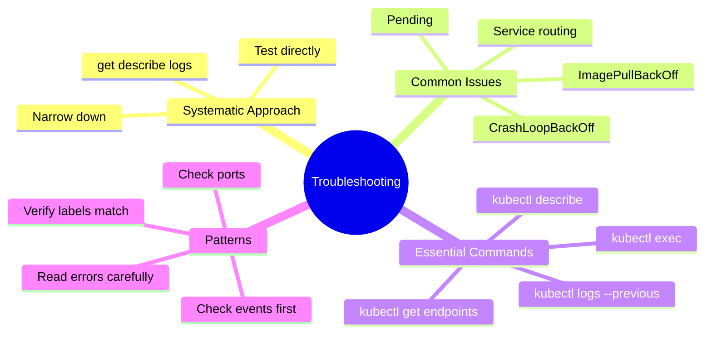

</div>

---
layout: center
---

# Key Takeaways

<div class="grid grid-cols-2 gap-6 mt-6">
<div v-click="1">
<carbon-search class="text-4xl text-blue-400 mb-2" />
<strong>Master describe</strong><br/>
<span class="text-sm opacity-80">Primary diagnostic tool</span>
</div>
<div v-click="2">
<carbon-document class="text-4xl text-green-400 mb-2" />
<strong>Check --previous</strong><br/>
<span class="text-sm opacity-80">Essential for crashes</span>
</div>
<div v-click="3">
<carbon-network-3 class="text-4xl text-purple-400 mb-2" />
<strong>Verify endpoints</strong><br/>
<span class="text-sm opacity-80">First step for services</span>
</div>
<div v-click="4">
<carbon-tag class="text-4xl text-yellow-400 mb-2" />
<strong>Label matching</strong><br/>
<span class="text-sm opacity-80">Most common issue</span>
</div>
</div>

<div v-click="5" class="mt-8 text-center text-xl">
<carbon-certificate class="inline-block text-3xl text-green-400" /> Follow systematic approach - don't guess! <carbon-arrow-right class="inline-block text-2xl" />
</div>
